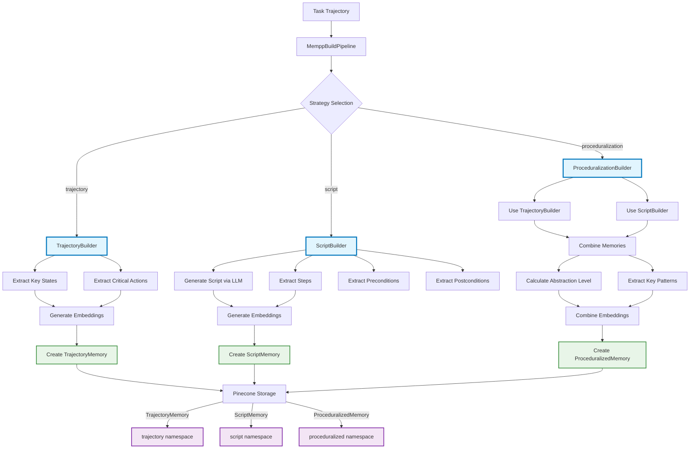
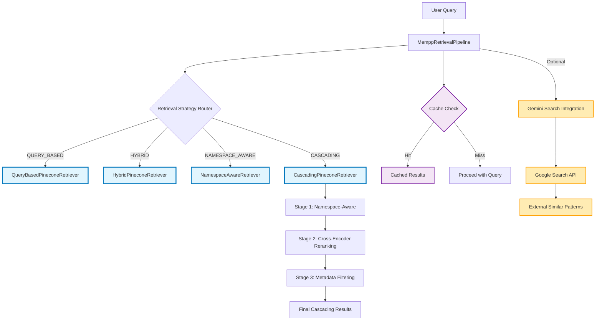

# MEMPP: Deep Architecture Analysis

**Memory-based Procedural Processing Pipeline**  
*A Sophisticated AI Agent Memory System with Pinecone Vector Database Integration*

## Executive Summary

MEMPP (Memory-based Procedural Processing Pipeline) is a sophisticated AI agent memory system that enables procedural learning from task execution experiences through a four-pipeline architecture built on Pinecone vector databases. The system transforms raw task execution trajectories into structured procedural knowledge, enabling agents to learn from past experiences and apply that knowledge to similar future tasks.

## System Overview

### Core Architecture Philosophy

MEMPP implements a **four-pipeline architecture** that processes memories through distinct stages:
1. **Build Pipeline**: Converts task execution trajectories into procedural memories
2. **Retrieve Pipeline**: Finds relevant memories for new tasks using advanced search strategies
3. **Update Pipeline**: Manages memory lifecycle through reflection, consolidation, and optimization
4. **System Pipeline**: Orchestrates the complete memory-augmented task execution workflow

### Key Innovation: Namespace-Driven Memory Evolution

The system uses **three Pinecone namespaces** that represent different maturation stages of procedural knowledge:
- **`trajectory`**: Raw execution traces with complete state/action/observation sequences
- **`script`**: LLM-abstracted procedural instructions with step-by-step guidance
- **`proceduralized`**: Combined trajectory + script knowledge optimized for retrieval

High-performing memories automatically **migrate between namespaces** based on success rate and usage patterns, creating a natural knowledge evolution system.

## 1. High-Level System Architecture

```mermaid
graph TD
    %% External Components
    Client[Client/User] --> API[MemppSystemAPI]
    API --> System[MemppSystem Core]
    
    %% External Services
    PineconeCloud[Pinecone Cloud] --> PineconeStorage[PineconeMemoryStorage]
    RedisCache[Redis Cache] --> RetrievalCache[RetrievalCache]
    Kafka[Kafka Events] --> EventBus[EventBus]
    
    %% LLM Providers
    OpenAIAPI[OpenAI API] --> Embeddings[OpenAI Embeddings]
    AnthropicAPI[Anthropic API] --> LLMProcessing[Claude LLM]
    GeminiAPI[Gemini API] --> Search[External Search]
    
    %% Core System
    System --> |1. Retrieve| RetrievePipeline[Retrieve Pipeline]
    System --> |2. Execute| TaskExecutor[Task Executor]
    System --> |3. Build| BuildPipeline[Build Pipeline]
    System --> |4. Update| UpdatePipeline[Update Pipeline]
    
    %% Pipeline Interactions
    RetrievePipeline --> PineconeStorage
    RetrievePipeline --> RetrievalCache
    RetrievePipeline --> Search
    
    BuildPipeline --> PineconeStorage
    BuildPipeline --> LLMProcessing
    BuildPipeline --> Embeddings
    
    UpdatePipeline --> PineconeStorage
    UpdatePipeline --> LLMProcessing
    UpdatePipeline --> ReflectionEngine[Reflection Engine]
    
    %% Memory Namespaces
    PineconeStorage --> TrajectoryNS[Trajectory Namespace]
    PineconeStorage --> ScriptNS[Script Namespace] 
    PineconeStorage --> ProcNS[Proceduralized Namespace]
    
    %% Monitoring & Events
    System --> EventBus
    System --> Metrics[Prometheus Metrics]
    System --> Health[Health Monitoring]
    
    %% Configuration
    Config[MemppSystemConfig] --> System
    Config --> API
    
    %% Styling
    classDef pipeline fill:#e1f5fe,stroke:#0277bd,stroke-width:3px
    classDef storage fill:#f3e5f5,stroke:#7b1fa2,stroke-width:2px
    classDef external fill:#fff3e0,stroke:#ef6c00,stroke-width:2px
    classDef memory fill:#e8f5e8,stroke:#388e3c,stroke-width:2px
    
    class RetrievePipeline,BuildPipeline,UpdatePipeline,TaskExecutor pipeline
    class PineconeStorage,RetrievalCache storage
    class PineconeCloud,RedisCache,Kafka,OpenAIAPI,AnthropicAPI,GeminiAPI external
    class TrajectoryNS,ScriptNS,ProcNS memory
```



## 2. Build Pipeline Architecture

The Build Pipeline transforms raw task execution experiences into structured procedural memories through three specialized builders.

### Key Components

- **TrajectoryBuilder**: Stores complete execution traces with key states and critical actions
- **ScriptBuilder**: Uses LLM (Claude) to abstract trajectories into step-by-step procedures
- **ProceduralizationBuilder**: Combines both approaches for optimal retrieval performance

### Memory Creation Strategies



## 3. Retrieve Pipeline Architecture

The Retrieve Pipeline provides sophisticated multi-strategy memory retrieval with Pinecone integration, intelligent caching, and external search augmentation.

### Retrieval Strategies

1. **Query-Based**: Direct semantic similarity search using dense embeddings
2. **Hybrid**: Combined dense + sparse vector search for comprehensive matching
3. **Namespace-Aware**: Intelligent namespace selection based on query characteristics
4. **Cascading**: Multi-stage retrieval with cross-encoder reranking

### Advanced Features

- **Multi-Level Caching**: TTL cache → Redis → Pinecone native caching
- **External Search Integration**: Gemini API for web search augmentation
- **Cross-Encoder Reranking**: Transformer-based secondary ranking for precision
- **Key Extraction**: Multiple algorithms (KeyBERT, YAKE, spaCy NER) for query analysis



## 4. Update Pipeline Architecture

The Update Pipeline manages memory lifecycle through sophisticated health monitoring, reflection-based correction, and intelligent consolidation.

### Core Update Strategies

- **Validation**: Only stores memories from successful task executions
- **Adjustment**: Uses LLM reflection to correct memories that led to failures
- **Consolidation**: Merges similar memories using DBSCAN clustering
- **Pruning**: Removes low-health memories based on composite scoring
- **Namespace Migration**: Promotes high-performing memories to optimal namespaces

### Memory Health System

Memory health is calculated using a **composite scoring formula**:
- **Success Rate**: 40% weight - How often the memory leads to successful outcomes
- **Usage Frequency**: 30% weight - How frequently the memory is retrieved and used
- **Recency**: 20% weight - How recently the memory was last used
- **Age Penalty**: 10% weight - Gradual decay for very old memories

### Reflection Engine

When tasks fail after retrieving memories, the **Reflection Engine** analyzes the failure:
1. Identifies why the memory was incorrectly retrieved
2. Determines what went wrong in execution
3. Generates corrected memory versions
4. Recommends namespace migrations or memory deprecation

## 5. System Pipeline Orchestration

The System Pipeline coordinates the complete memory-augmented task execution workflow:

**Step 1: Memory Retrieval**
- Applies retrieval configuration and namespace preferences
- Executes chosen retrieval strategy across relevant Pinecone namespaces
- Returns ranked memories with similarity scores

**Step 2: Task Execution**
- Uses either simulated or LLM-based task executors
- Provides memory context to boost execution success rates
- Generates complete trajectory with states, actions, and observations

**Step 3: Memory Building**
- Applies configured build strategy (trajectory/script/proceduralization)
- Generates embeddings using Multilingual E5 + BM25 sparse encoding
- Creates new procedural memory object

**Step 4: Memory Update**
- Triggers reflection analysis for failed executions
- Performs batch updates including consolidation and pruning
- Updates Pinecone metadata and health scores

## 6. Data Models and Memory Types

### Memory Class Hierarchy

```python
ProceduralMemory (Base Class)
├── TrajectoryMemory      # Raw execution traces
├── ScriptMemory          # LLM-abstracted procedures  
└── ProceduralizedMemory  # Combined trajectory + script
```

### Core Data Structures

**Trajectory**: Complete task execution record
```python
@dataclass
class Trajectory:
    task_id: str
    task_description: str
    states: list[State]              # Environment states
    actions: list[Action]            # Agent actions
    observations: list[Observation]  # Environment responses
    status: TaskStatus              # SUCCESS/FAILURE/PARTIAL
    final_reward: float
    metadata: dict[str, Any]
```

**ProceduralMemory**: Base memory class with health tracking
```python
@dataclass  
class ProceduralMemory:
    memory_id: str
    task_pattern: str
    embedding: np.ndarray            # 1024D Multilingual E5
    sparse_embedding: dict[str, float]  # BM25 sparse vector
    usage_count: int
    success_rate: float              # Exponential moving average
    metadata: dict[str, Any]
```

## 7. Pinecone Integration Architecture

### Namespace Organization

MEMPP organizes vectors in Pinecone using three dedicated namespaces:

```mermaid
graph TD
    PineconeIndex[Pinecone Index: mempp-memories] --> IndexConfig[Index Configuration]
    IndexConfig --> Dimension[Dimension: 1024]
    IndexConfig --> Metric[Metric: dotproduct]
    IndexConfig --> ServerlessSpec[Serverless AWS us-east-1]
    
    PineconeIndex --> Namespace1[(trajectory namespace)]
    PineconeIndex --> Namespace2[(script namespace)]  
    PineconeIndex --> Namespace3[(proceduralized namespace)]
    
    %% Trajectory Namespace Detail
    Namespace1 --> TrajVectors[Dense + Sparse Vectors]
    Namespace1 --> TrajMetadata[Trajectory Metadata]
    TrajMetadata --> TrajMemoryType[memory_type: trajectory]
    TrajMetadata --> TrajTaskPattern[task_pattern: truncated 500 chars]
    TrajMetadata --> TrajUsageCount[usage_count: integer]
    TrajMetadata --> TrajSuccessRate[success_rate: float 0-1]
    
    %% Script Namespace Detail  
    Namespace2 --> ScriptVectors[Dense + Sparse Vectors]
    Namespace2 --> ScriptMetadata[Script Metadata]
    ScriptMetadata --> ScriptMemoryType[memory_type: script]
    ScriptMetadata --> ScriptAbstractionMethod[abstraction_method: llm_based]
    
    %% Proceduralized Namespace Detail
    Namespace3 --> ProcVectors[Dense + Sparse Vectors]  
    Namespace3 --> ProcMetadata[Proceduralized Metadata]
    ProcMetadata --> ProcMemoryType[memory_type: proceduralized]
    ProcMetadata --> ProcCombinationMethod[combination_method: weighted_average]
    
    %% Styling
    classDef namespace fill:#f3e5f5,stroke:#7b1fa2,stroke-width:4px
    classDef vector fill:#e1f5fe,stroke:#0277bd,stroke-width:2px
    classDef metadata fill:#e8f5e8,stroke:#388e3c,stroke-width:2px
    
    class Namespace1,Namespace2,Namespace3 namespace
    class TrajVectors,ScriptVectors,ProcVectors vector
    class TrajMetadata,ScriptMetadata,ProcMetadata metadata
```



### Hybrid Search Implementation

MEMPP implements Pinecone's hybrid search combining:
- **Dense Vectors**: 1024-dimensional Multilingual E5 embeddings
- **Sparse Vectors**: BM25-encoded keyword representations
- **Weighted Scoring**: α = 0.7 (dense) + 0.3 (sparse) for optimal performance

## 8. Memory Lifecycle and Evolution

### Memory Maturation Process

```mermaid
graph LR
    %% Task Execution Flow
    NewTask[New Task Execution] --> RawTrajectory[Raw Trajectory Data]
    
    %% Initial Memory Creation
    RawTrajectory --> TrajectoryBuilder[Trajectory Builder]
    TrajectoryBuilder --> TrajectoryMemory[TrajectoryMemory]
    TrajectoryMemory --> |Store| TrajectoryNS[(trajectory namespace)]
    
    %% Memory Evolution Path 1: Script Abstraction
    RawTrajectory --> ScriptBuilder[Script Builder]  
    ScriptBuilder --> |LLM Abstraction| ScriptMemory[ScriptMemory]
    ScriptMemory --> |Store| ScriptNS[(script namespace)]
    
    %% Memory Evolution Path 2: Combined Proceduralization  
    TrajectoryMemory --> ProcBuilder[Proceduralization Builder]
    ScriptMemory --> ProcBuilder
    ProcBuilder --> |Combine & Abstract| ProceduralizedMemory[ProceduralizedMemory]
    ProceduralizedMemory --> |Store| ProcNS[(proceduralized namespace)]
    
    %% Memory Maturation Triggers
    TrajectoryNS --> |High Success Rate\n+ Usage Count ≥ 5| MigrationTrigger1[Migration Trigger]
    MigrationTrigger1 --> |Automated Migration| ProcNS
    
    ScriptNS --> |Proven Effectiveness\n+ High Abstraction| MigrationTrigger2[Migration Trigger] 
    MigrationTrigger2 --> |Automated Migration| ProcNS
    
    %% Styling
    classDef memory fill:#e8f5e8,stroke:#388e3c,stroke-width:3px
    classDef namespace fill:#f3e5f5,stroke:#7b1fa2,stroke-width:3px
    classDef process fill:#e1f5fe,stroke:#0277bd,stroke-width:2px
    
    class TrajectoryMemory,ScriptMemory,ProceduralizedMemory memory
    class TrajectoryNS,ScriptNS,ProcNS namespace
    class TrajectoryBuilder,ScriptBuilder,ProcBuilder process
```



### Self-Improvement Through Reflection

When memories lead to task failures, MEMPP employs a sophisticated **reflection system**:

1. **Failure Analysis**: LLM analyzes why a retrieved memory led to poor execution
2. **Root Cause Identification**: Determines if the issue was retrieval accuracy or execution guidance
3. **Memory Correction**: Generates corrected versions with improved instructions
4. **Namespace Optimization**: Recommends optimal namespace placement for better future retrieval

## 9. Performance Optimization Architecture

### Multi-Level Caching System

MEMPP implements a **three-tier caching architecture**:

- **L1 Cache**: In-memory TTL cache (1000 entries, 1-hour TTL)
- **L2 Cache**: Redis distributed cache with automatic failover to L1
- **L3 Cache**: Pinecone's native query result caching

### Vector Optimization Strategies

- **Hybrid Search Optimization**: Dynamic weighting between dense and sparse vectors
- **Batch Processing**: Optimized batch operations for memory building, retrieval, and updates
- **Embedding Acceleration**: CUDA/MPS acceleration with CPU fallback
- **Query Performance**: Pattern analysis, common query caching, and prefetch strategies

### Namespace Load Balancing

The system automatically rebalances Pinecone namespaces:
- **Capacity Monitoring**: Triggers rebalancing when namespaces exceed 5000 vectors
- **Performance-Based Migration**: Moves high-performing memories to optimal namespaces
- **Health-Based Pruning**: Removes low-value memories to maintain performance

## 10. Event System and Distributed Architecture

### Event-Driven Architecture

MEMPP uses comprehensive event tracking for system coordination:

**Event Types**:
- `TASK_STARTED`, `TASK_COMPLETED`, `TASK_FAILED`
- `MEMORY_BUILT`, `MEMORY_RETRIEVED`, `MEMORY_UPDATED`
- `MEMORY_CONSOLIDATED`, `MEMORY_PRUNED`
- `NAMESPACE_MIGRATED`, `INDEX_OPTIMIZED`
- `SYSTEM_HEALTH_CHECK`

### Distributed Computing Integration

- **Ray Cluster Support**: Distributed memory operations across multiple nodes
- **Kafka Event Streaming**: Cross-service communication with event replay capability  
- **Auto-Scaling**: Dynamic worker provisioning based on system load
- **Circuit Breaker Pattern**: Prevents cascade failures in distributed components

## 11. Monitoring and Health Management

### Comprehensive Observability

MEMPP provides production-ready monitoring through:

**Prometheus Metrics**:
- Task execution rates, success rates, and latency distributions
- Memory health scores per namespace
- Pinecone index statistics and query performance
- System resource utilization (CPU, memory, network)

**Health Monitoring**:
- Component-level health checks (Pinecone, pipelines, external services)
- Memory health assessment with actionable recommendations
- Automated alerting for capacity, performance, and error thresholds

**Structured Logging**:
- JSON-formatted logs with correlation IDs
- Performance tracing across distributed components
- Error analysis and failure pattern detection

## 12. Configuration and Deployment

### Environment Configuration

```yaml
# Core Pinecone Configuration
pinecone_api_key: ${PINECONE_API_KEY}
pinecone_environment: us-east-1
pinecone_index_name: mempp-memories
pinecone_use_serverless: true
pinecone_dimension: 1024

# Namespace Configuration  
default_namespaces: [proceduralized, script, trajectory]
namespace_auto_balance: true
max_vectors_per_namespace: 5000

# Retrieval Configuration
retrieval_strategy: CASCADING
use_hybrid_search: true
alpha: 0.7  # Dense vs sparse weight
use_reranking: true
similarity_threshold: 0.7

# Update Configuration  
continuous_learning: true
reflection_enabled: true
consolidation_threshold: 0.9
namespace_migration_enabled: true

# External Services
redis_url: redis://localhost:6379
kafka_brokers: [localhost:9092]
anthropic_api_key: ${ANTHROPIC_API_KEY}
gemini_api_key: ${GEMINI_API_KEY}
```

### Deployment Modes

**Development Mode**: Uses in-memory storage with deterministic embeddings
```bash
mempp --mode demo --pinecone-key dev-key
```

**API Server Mode**: Full REST API with Pinecone backend
```bash  
mempp --mode api --port 8000 --pinecone-key $PINECONE_API_KEY
```

**Worker Mode**: Background processing with continuous learning
```bash
mempp --mode worker --pinecone-key $PINECONE_API_KEY
```

## 13. Key Design Patterns and Best Practices

### Architecture Design Patterns

1. **Pipeline Pattern**: Clean separation of concerns across four specialized pipelines
2. **Strategy Pattern**: Pluggable retrieval and update strategies 
3. **Protocol Pattern**: Interface-based extensibility for embedders and executors
4. **Event Sourcing**: All state changes captured as events for audit and replay
5. **Circuit Breaker**: Fault tolerance for external service dependencies

### Performance Best Practices

1. **Lazy Initialization**: Components initialized only when needed
2. **Connection Pooling**: Reused connections for Pinecone, Redis, and LLM APIs
3. **Batch Operations**: Optimized batch processing for memory operations
4. **Async/Await**: Non-blocking I/O throughout the system
5. **Resource Pooling**: Shared embedder instances and vector buffers

### Memory Management Best Practices

1. **Health-Driven Lifecycle**: Memories managed based on composite health scores
2. **Automatic Consolidation**: Similar memories merged to reduce redundancy
3. **Intelligent Migration**: Memories promoted between namespaces based on performance
4. **Graceful Degradation**: System continues operating when external services fail
5. **Local Backup**: Persistent disk backup of critical memory data

## 14. Future Architecture Considerations

### Scalability Enhancements

- **Multi-Index Support**: Scale beyond single Pinecone index limitations
- **Federated Search**: Cross-index querying for enterprise deployments
- **Advanced Clustering**: More sophisticated memory grouping algorithms
- **Real-Time Learning**: Sub-second memory updates for real-time applications

### AI/ML Enhancements

- **Advanced Reflection**: Multi-agent reflection systems for complex failure analysis
- **Predictive Caching**: ML-based prediction of likely query patterns
- **Dynamic Weighting**: Learned optimal dense/sparse weighting per query type
- **Automated Strategy Selection**: ML-based selection of optimal retrieval strategies

## Conclusion

MEMPP represents a sophisticated approach to AI agent memory management, combining state-of-the-art vector search capabilities with intelligent memory lifecycle management. The architecture provides both the flexibility for research and development and the robustness required for production deployments.

The **namespace-driven memory evolution** system is particularly innovative, allowing memories to naturally mature from concrete experiences to abstract procedural knowledge while maintaining optimal retrieval performance. Combined with the **reflection-based self-improvement** capabilities, MEMPP creates a truly learning memory system that gets better over time.

The architecture is designed for **production scalability** with comprehensive monitoring, health management, and distributed computing support, while maintaining clean separation of concerns and extensibility for future enhancements.